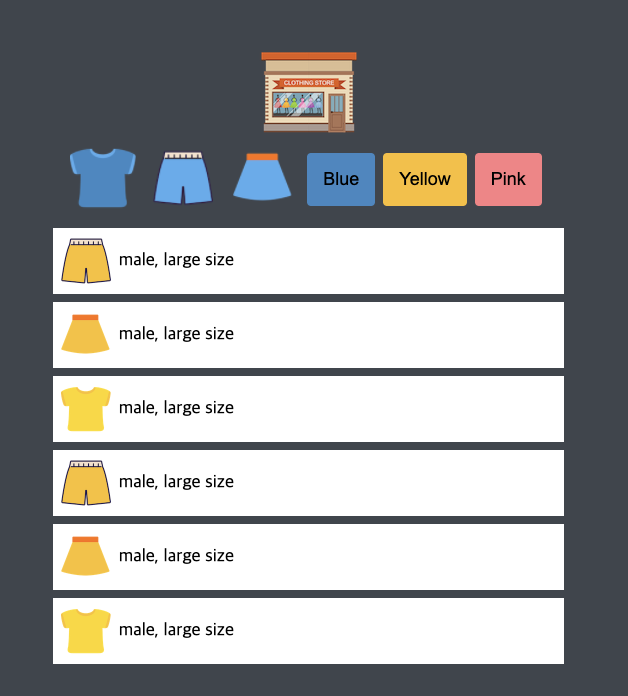
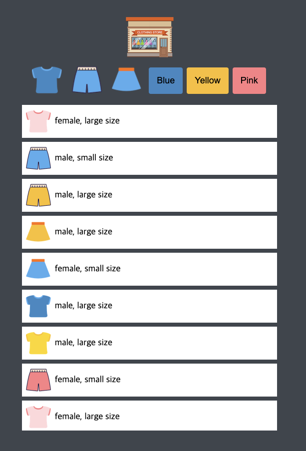

# 드림코딩 엘리 웹 프론트 기본
#### 드림코딩 엘리 웹 프론트 기본

# stack
- html
- css
- js
- json

# Architecture
## 프로젝트 구조
> front (web root)
>> css 
>> js (java script)
>> res (resources)
>>> img (image)
> back (back root)
>> res
>>> data
> app.js (express web server)

# 기간
- 0321 21:00 ~ 21:30

# 주요 기능
- json 형태의 data를 fetch를 사용해서 요청
- 아이템을 동적으로 생성
- 버튼 클릭시 필터링

# 결과물

# Note
### 여러 개의 변수를 한번에 선언하는 것은 var hoisting의 잔재.
### string template , backtick을 사용하자. ``
-  타이핑이 줄어들고 가독성이 좋아짐
### DRY , Dont Repeat Yourself
- 스스로를 반복하지 말거라..
- element 를 지우고 추가하기 보다는 가능 하다면 hidden 처리를 진행해라.
- 반복해서 같은 이벤트를 넣기 보다는 이벤트 위임을 사용해라.
### 한가지 펑션 에는 한가지 기능만 넣도록
### Early Exit
- 안으로 중첩되는 코드는 가독성이 많이 떨어짐
- 먼저 예외처리를 진행.
### 코드 스타일은 일관성 있게!
### swich case 에서 break을 쓰지 않으면 && 가 아니라 || 로 작동을 한다.
- default 는 가장 기본일 때에만 써야 한다.
- 우리가 알고있는 타입이 아닌 경우 
- 절대 default로 빠지면 안되는 상황을 작성.
### 함수 이름은 직관적으로.
### 함수의 인자는 최소한의 범위로 전송을 하면 좋다.

